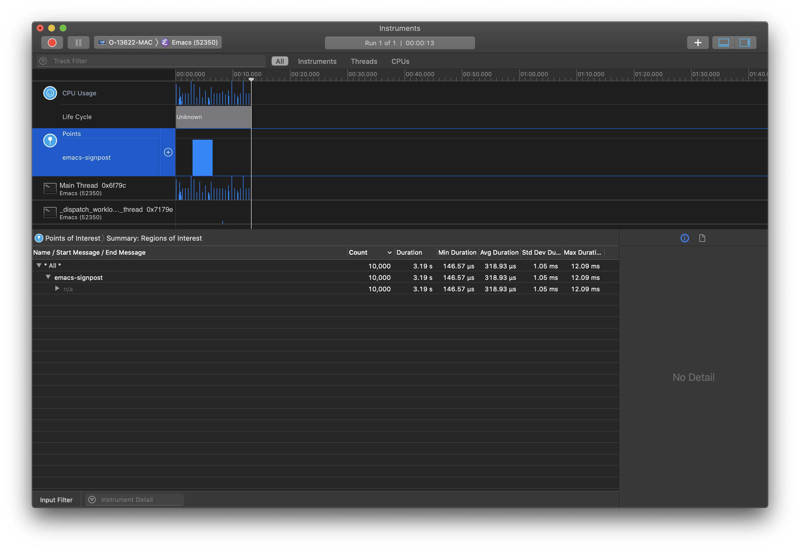

# postsign

Emacs interface of macOS [signpost](https://developer.apple.com/videos/play/wwdc2018/405/). This is a hobby product.

## How to use

### Build

```bash
% make
```

### Example

```lisp
(require 'signpost)
(require 'json)

(let ((log-obj (signpost-log-create "json-read")))
  (dotimes (_ 10000)
    (with-signpost log-obj
      (json-read-file "data/test.json"))))
```

1. Open `Instruments` -> `Time Profiler`
2. Attach to Emacs process
3. Start profiling
4. Run emacs lisp code like above snippet

Then you can get profiling as below


